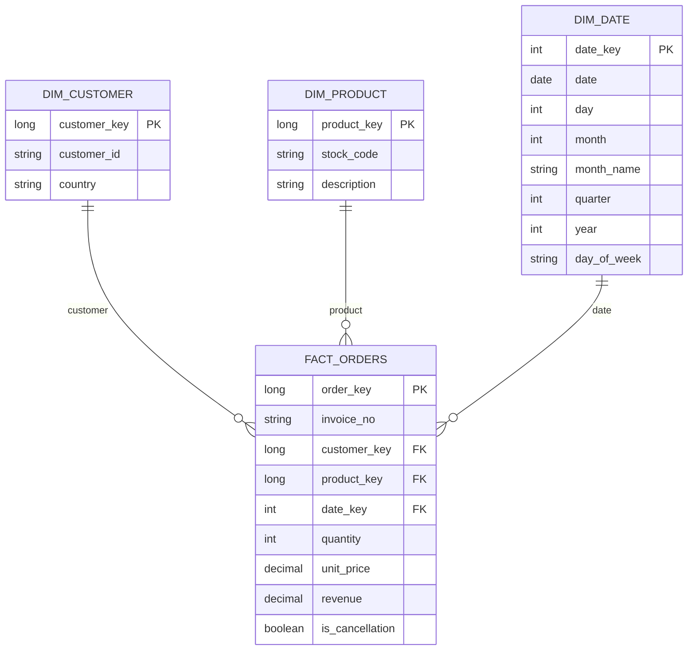

# Dimensional Model

## Approach

I chose a star schema for the gold layer because the use case revolves around orders, products and revenue. This design minimizes the number of joins required to compute KPIs such as revenue per country. With only three source tables, a snowflake schema would add normalization and complexity without any real benefit. The model intentionally remains simple and avoids introducing historical dimensions or additional entities that cannot be reliably supported by the available source data; identified source-data ambiguities are instead documented as data quality issues below.

The model consists of a single fact table, `fact_orders`, and three dimension tables: `dim_product`, `dim_customer` and `dim_date`.

## Grain

One row represents an individual order line from the source, after removing exact duplicates. `(InvoiceNo, StockCode)` is not unique, as the same product can legitimately appear multiple times within the same invoice with different quantities. `InvoiceNo` is retained on the fact table as a degenerate dimension rather than its own table.

## Tables

### dim_customer

| Column | Description |
|---|---|
| `customer_key` | surrogate key |
| `customer_id` | business key |
| `country` | |

Orders without a `CustomerID` are mapped to an Unknown Customer member. Customer-country conflicts identified during data profiling are treated as a data quality issue.

### dim_product

| Column | Description |
|---|---|
| `product_key` | surrogate key |
| `stock_code` | business key |
| `description` | |

Product price is not modelled as a stable product attribute: profiling identified multiple prices for some products without sufficient temporal information to determine which applies when. Price is instead captured per order line, on `fact_orders`.

### dim_date

| Column | Description |
|---|---|
| `date_key` | surrogate key |
| `date` | |
| `day` | |
| `month` | |
| `month_name` | |
| `quarter` | |
| `year` | |
| `day_of_week` | |

Derived from `InvoiceDate`; provides the calendar attributes required for time-based analytics.

### fact_orders

| Column | Description |
|---|---|
| `order_key` | surrogate key |
| `invoice_no` | degenerate dimension |
| `customer_key` | FK -> dim_customer |
| `product_key` | FK -> dim_product |
| `date_key` | FK -> dim_date |
| `quantity` | |
| `unit_price` | |
| `revenue` | `quantity * unit_price` |
| `is_cancellation` | |

Orders for which a reliable product price cannot be established are excluded from the affected Gold analytics.

## Diagram

