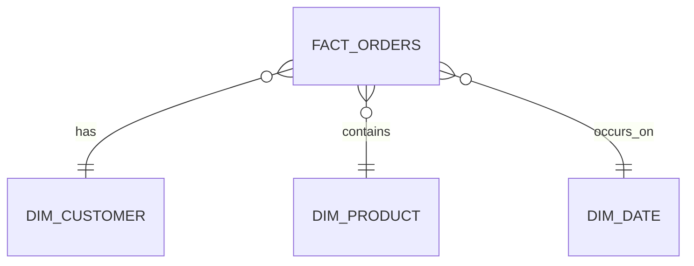

# Dimensional Model

## Approach

<!-- TODO: star schema / other, and why -->

## Grain

<!-- TODO: define the grain of the fact table(s) explicitly -->

## Tables

### dim_customer

<!-- TODO: columns, keys -->

### dim_product

<!-- TODO: columns, keys. Note: products are ingested daily as snapshots,
     decide and document how price history is handled (SCD2 vs separate
     daily price fact) -->

### dim_date

<!-- TODO -->

### fact_orders

<!-- TODO: columns, keys, measures -->

## Diagram

<!-- TODO: mermaid erDiagram, e.g.:

-->

## Design decisions

<!-- TODO: notable choices and trade-offs, e.g. how price-drop history is
     modeled, how late-arriving or duplicate records are handled -->
