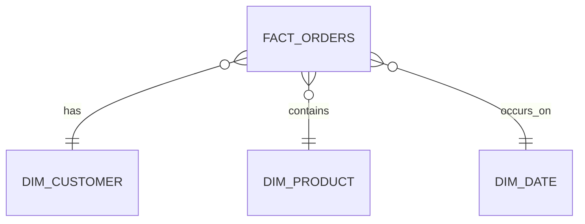

# Dimensional Model

## Approach

I chose a star schema for the gold layer because the use case revolves around orders, products and revenue. This design minimizes the number of joins required to compute KPIs such as revenue per country. With only three source tables, a snowflake schema would add normalization and complexity without any real benefit. The model therefore consists of a single fact table, `fact_orders`, and three dimension tables: `dim_product`, `dim_customer` and `dim_date`.

## Grain

One row represents an individual order line from the source, after removing exact duplicates. (InvoiceNo, StockCode) is not unique, as the same product can legitimately appear multiple times within the same invoice with different quantities.

## Tables

### dim_customer

<!-- TODO: columns, keys -->
customer(CustomerID,Country)

### dim_product

Product(StockCode,Description,UnitPrice)

<!-- TODO: columns, keys. Note: products are ingested daily as snapshots,
     decide and document how price history is handled (SCD2 vs separate
     daily price fact) -->

### dim_date

<!-- TODO -->

### fact_orders

order(InvoiceNo,StockCode,Quantity,InvoiceDate,CustomerID)
<!-- TODO: columns, keys, measures -->

## Diagram

<!-- TODO: mermaid erDiagram, e.g.:

-->

## Design decisions

<!-- TODO: notable choices and trade-offs, e.g. how price-drop history is
     modeled, how late-arriving or duplicate records are handled -->
