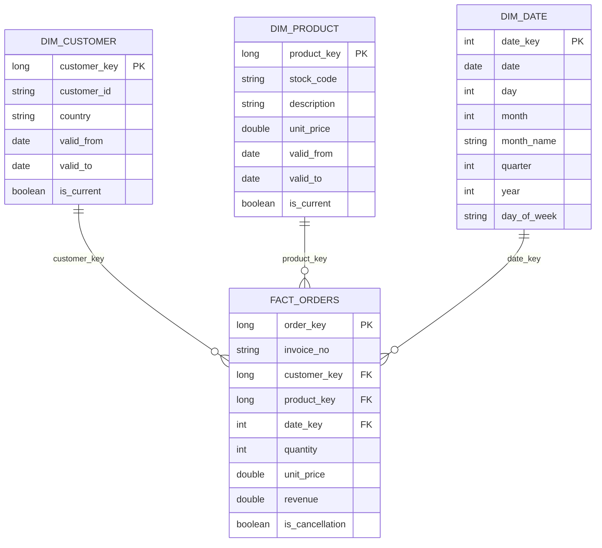

# Dimensional Model

## Approach

The Gold layer uses a star schema centred around orders and revenue. The model consists of one fact table, `fact_orders`, and three dimensions: `dim_product`, `dim_customer`, and `dim_date`.

`dim_customer` and `dim_product` are implemented as Slowly Changing Dimensions Type 2 (SCD2). Changes observed across different daily snapshots are preserved as new historical versions. Conflicting states within the same snapshot are treated as data quality issues and excluded from Gold rather than interpreted as historical changes.

## Grain

One row in `fact_orders` represents an individual order line from the source, after removing exact duplicates.

`(InvoiceNo, StockCode)` is not unique, as the same product can legitimately appear multiple times within the same invoice with different quantities.

`InvoiceNo` is retained on the fact table as a degenerate dimension rather than modelled as a separate dimension.

## Tables

### dim_customer

| Column | Description |
|---|---|
| `customer_key` | Surrogate key identifying a customer version |
| `customer_id` | Customer business key |
| `country` | Customer country |
| `valid_from` | Start date of the SCD2 version |
| `valid_to` | End date of the SCD2 version |
| `is_current` | Indicates the current version |

`customer_id` may therefore have multiple historical versions, while `customer_key` uniquely identifies each version.

Orders without a `CustomerID`, or without a valid customer mapping, are mapped to an Unknown Customer member (`customer_key = -1`).

Conflicting countries for the same customer within the same ingestion snapshot are treated as a data quality issue and excluded from the dimension.

### dim_product

| Column | Description |
|---|---|
| `product_key` | Surrogate key identifying a product version |
| `stock_code` | Product business key |
| `description` | Product description |
| `unit_price` | Product price for this version |
| `valid_from` | Start date of the SCD2 version |
| `valid_to` | End date of the SCD2 version |
| `is_current` | Indicates the current version |

`stock_code` may have multiple historical versions when its description or price changes across daily snapshots.

Conflicting `(Description, UnitPrice)` states for the same product within a single snapshot are treated as a data quality issue and excluded from Gold rather than selecting an arbitrary value.

### dim_date

| Column | Description |
|---|---|
| `date_key` | Integer date key in `yyyyMMdd` format |
| `date` | Calendar date |
| `day` | Day of month |
| `month` | Month number |
| `month_name` | Month name |
| `quarter` | Calendar quarter |
| `year` | Calendar year |
| `day_of_week` | Day name |

The dimension is derived from valid `InvoiceDate` values and provides calendar attributes for time-based analytics.

### fact_orders

| Column | Description |
|---|---|
| `order_key` | Deterministic surrogate key for the order line |
| `invoice_no` | Degenerate dimension |
| `customer_key` | FK → `dim_customer` |
| `product_key` | FK → `dim_product` |
| `date_key` | FK → `dim_date` |
| `quantity` | Ordered quantity |
| `unit_price` | Reference product price used for the order line |
| `revenue` | `quantity * unit_price` |
| `is_cancellation` | Indicates a cancellation invoice |

Negative quantities and cancellations are preserved as source business events.

Orders without a valid product mapping are excluded because a reliable `unit_price` and therefore `revenue` cannot be established.

## Historical limitation

`ingestion_date` represents the processing date of the available customer and product snapshots, not the historical effective date of those attributes.

The provided orders predate these snapshots, so `InvoiceDate` cannot be reliably used for a temporal join against the SCD2 validity ranges.

For the provided dataset, `fact_orders` therefore uses the current/reference customer and product versions. The SCD2 model preserves changes observed from future daily snapshots onwards.

Accurate historical attribution would require effective-dated customer and product history from the source system.

## Diagram

